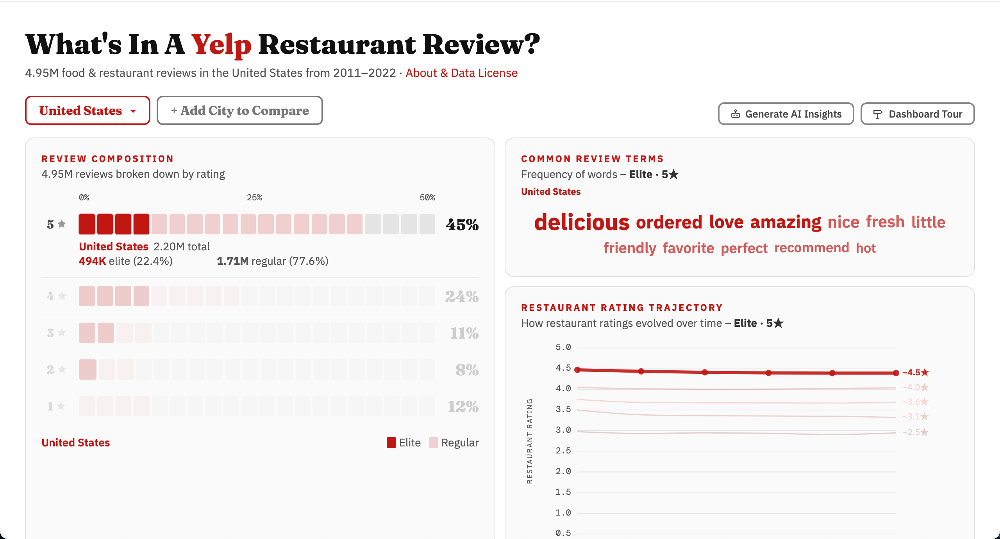
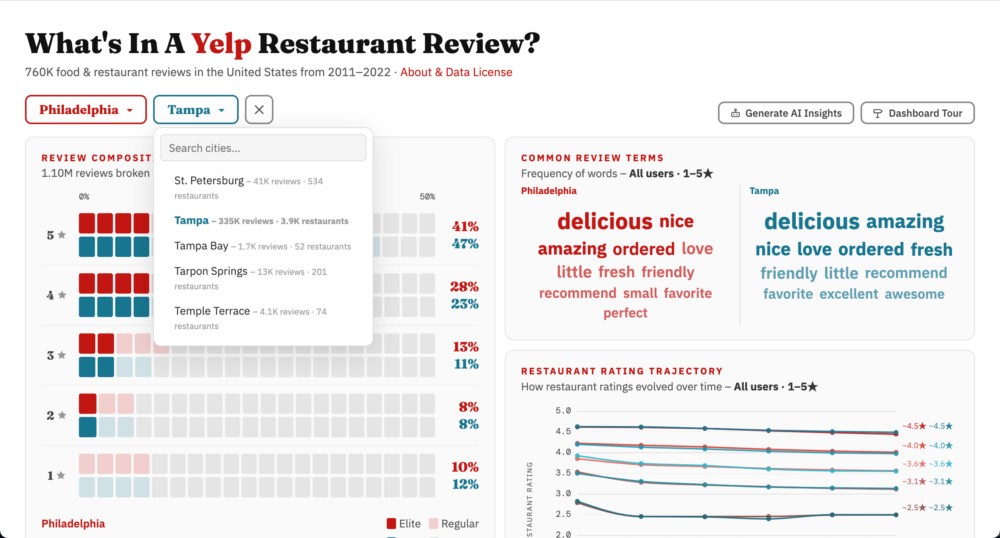
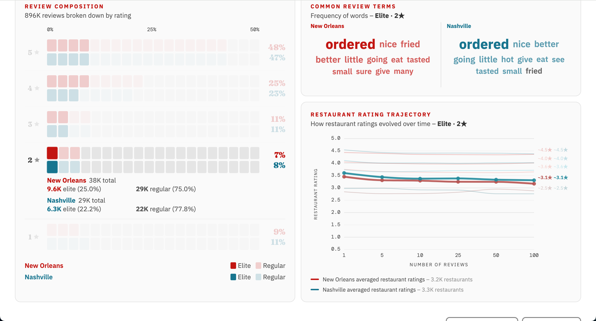
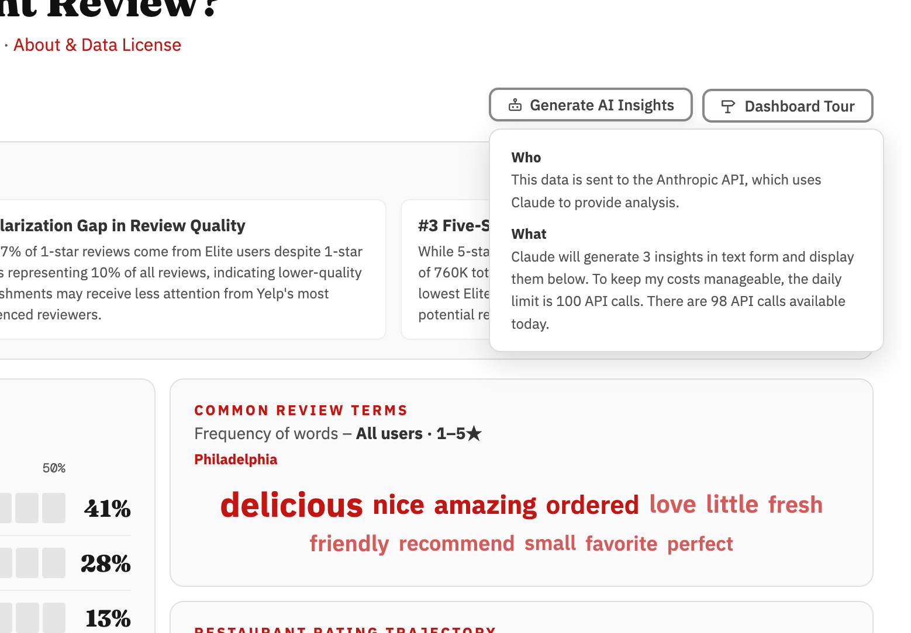
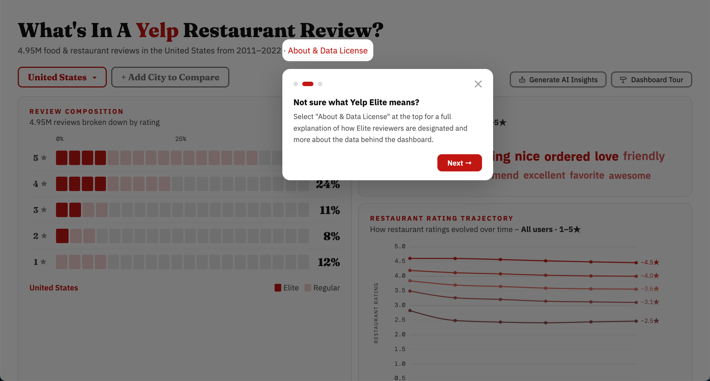

## Yelp Restaurant Review Dashboard
This is an interactive data dashboard exploring 4.95 million Yelp food and restaurant reviews across the United States from 2011–2022. The dashboard surfaces differences between Elite and Regular Yelp reviewers across star ratings, common language, and how restaurant ratings evolve over time.

**[Live site →](https://jaspermtom.github.io/yelp-review-dashboard/)**

<br>

## Features
### Review Composition
Breaks down the share of 1–5★ reviews for any U.S. location. Hover over any star row to see the split between Elite and Regular reviewers, and how that filters through to the word cloud and trajectory chart.



<br>

### City Comparison
Show Image
Add a second city to compare its review distribution side by side with the United States national baseline or any other city in the dataset.



<br>

### Restaurant Rating Trajectory
Tracks how restaurant ratings changed on average as they accumulated more reviews, grouped into five tiers by final rating (~4.5★, ~4.0★, ~3.6★, ~3.1★, ~2.5★). Hover a star row in Review Composition to highlight the corresponding tier. Switch between Elite, Regular, and All users to see how each group's reviews shaped a restaurant's trajectory.



<br>

### AI Insights
Generates three data-driven insights about the currently selected location using the Anthropic API.



<br>

### Dashboard Tour
A guided walkthrough for first-time visitors that highlights each section of the dashboard and explains what to look for.



<br>

## Data
This dashboard uses the [Yelp Open Dataset](https://business.yelp.com/data/resources/open-dataset/), a publicly available subset of Yelp data intended for personal, educational, and academic purposes.<br>**Scope:** Food and restaurant businesses only, with 20 or more reviews, from 2011–2022.<br>**Processing:** Raw review data was aggregated into summary statistics by star rating, user type (Elite vs. Regular), and location. No individual review text or user data is stored or displayed.<br>**Data License:** Use of the underlying Yelp data is governed by the [Yelp Dataset License Agreement](https://docs.google.com/document/d/1UsdiaLglLrXpjnxXiUdN2uFI7bYFH9wEIP7JYvAITcw/edit?tab=t.0). <br>
- The data may be used for personal, educational, and academic purposes only
- Commercial use is prohibited
- You may not attempt to identify individual users or businesses beyond what is publicly available
- Yelp retains all rights to the underlying data

This dashboard is an independent analysis and is not affiliated with, endorsed by, or sponsored by Yelp Inc.

<br>

## Tech Stack
- **Frontend:** React + Vite
- **Charts:** D3.js
- **Analytics:** PostHog (proxied via Cloudflare Workers)
- **AI:** Anthropic API (Claude), proxied via Cloudflare Workers
- **Hosting:** GitHub Pages
- **Deployment:** GitHub Actions

<br>

### Local Development
 
```bash
# Install dependencies
npm install
 
# Start dev server
npm run dev
```
The dev server runs at http://localhost:5173/yelp-review-dashboard/.
Note: The AI Insights feature calls the Anthropic API through a Cloudflare Worker configured for the production domain. It will not work locally unless you update the Worker's CORS origin to allow localhost.

<br>

### Project Structure
```
yelp-review-dashboard/
├── public/
│   └── data/
│       ├── national.json        # U.S. aggregate data
│       ├── city_index.json      # City list and metadata
│       └── cities/              # Per-city JSON files
├── src/
│   ├── App.jsx                  # Main application
│   └── main.jsx                 # Entry point
├── .github/
│   └── workflows/
│       └── deploy.yml           # GitHub Actions deploy
├── index.html
└── vite.config.js
```

<br>

### Credits
Independent analysis by Jasper Tom. Data provided by Yelp Inc. under the Yelp Open Dataset license.
